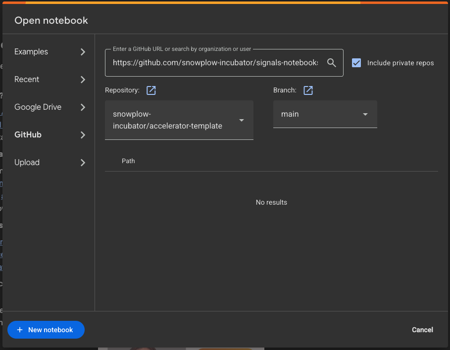

# Signals noteboooks

Notebooks for testing the Signals stream and batch attribute generation.

## Usage

1. Install poetry
2. Install dependencies:

```sh
poetry install --no-root
```

3. Copy the `.env.example` file into a `.env` file and fill in the API keys and Console organization ID.
4. Open with Visual Studio Code and navigate to a notebook
5. Make sure that you are using the same Python interpreter as used for installing the dependencies

## Google Colab
To run these notebooks using Google Colab, follow these steps:

#### Step 1: Copy the GitHub Repository Link
Start by copying the link to the GitHub repository containing the notebook you want to run. Click the green “Code” button, and select “Copy” to copy the repository link.

#### Step 2: Access Google Colab
Open Google Colab in your web browser at [colab.research.google.com](colab.research.google.com). Sign in to your Google account if you’re not already logged in.

#### Step 3: Connect to the GitHub Repository
In the Colab interface, click “GitHub,” enter the GitHub URL, and hit the search icon.



#### Step 4: Open the Notebook
Select the repository, the branch and the Jupyter notebook you want to open.

#### Step 5: Run the Notebook
With the notebook directory open, you can run the notebook cells just as you would in a local Jupyter notebook.


